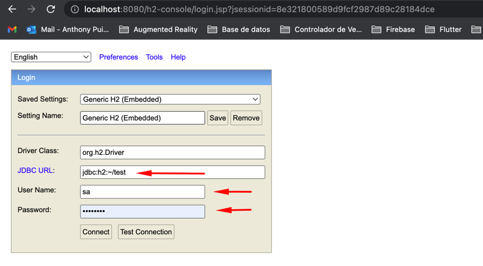

# product-microservice
This is a personal project in order to understand better microservices,
and it split by section and commits.

[](https://travis-ci.org/joemccann/dillinger)

**H2 Browser console !**
```sh
http://localhost:8080/h2-console
```

To Access is necessary to look in the application.yml file,
we have the url, username and password
```sh
spring:
  datasource:
  url: jdbc:h2:~/test
  username: sa
  password: password
```



  
> Note: Remember to start up this project with H2 is necessary initialize it
```sh
spring:
  jpa:
    hibernate:
      ddl-auto: create-drop
```


#  **JWT (JSON Web Token)**

JWT is popular for Authentication and Information Exchange. Server encodes data into a JSON Web Token and send it to the Client. The Client saves the JWT, then every Request from Client to protected routes or resources should be attached that JWT (commonly at header). The Server will validate that JWT and return the Response.

There are three important parts of a JWT: Header, Payload, Signature. Together they are combined to a standard structure: header.payload.signature.


Spring Security Authentication process: receive HTTP request, filter, authenticate, store Authentication data, generate token, get User details, authorize, handle exception…

## Sonarqube/PostgreSQL in Apple M1 Chip

### ⚡️ Quickstart

- Install Docker from [here](https://www.docker.com/)
- Start Docker App 
- Clone this repository in your development path

### ‍💻 Installation

In your terminal on your cloned path

- Run `docker build --pull --rm -f "Dockerfile" -t localsonar:staging "."`
- Run `docker-compose up -d`
- Check in your navegator the addres **localhost:9000**
- User and Pasword are "admin"

#### Enjoy your SonarQube in M1 Apple

# Contribution

- Report issues
- Open pull request with improvements
- Spread the word
- Reach out to me directly at <anthony.puitiza.02@gmail.com>
